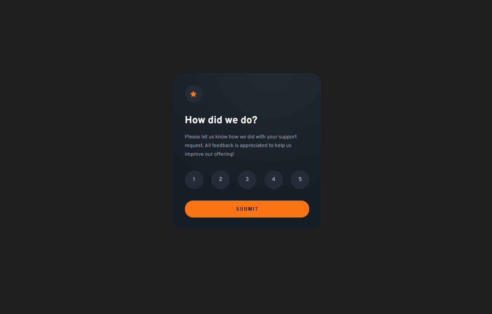

# Frontend Mentor - Interactive rating component solution

This is a solution to the [Interactive rating component challenge on Frontend Mentor](https://www.frontendmentor.io/challenges/interactive-rating-component-koxpeBUmI). Frontend Mentor challenges help you improve your coding skills by building realistic projects.

## Table of contents

- [Overview](#overview)
  - [The challenge](#the-challenge)
  - [Screenshot](#screenshot)
  - [Links](#links)
- [My process](#my-process)
  - [Built with](#built-with)
  - [What I learned](#what-i-learned)
  - [Useful resources](#useful-resources)
- [Author](#author)

## Overview

### The challenge

Users should be able to:

- View the optimal layout for the app depending on their device's screen size
- See hover states for all interactive elements on the page
- Select and submit a number rating
- See the "Thank you" card state after submitting a rating

### Screenshot

### Links

- Live Site URL: [Rating component / Vercel deployment](https://fm-interactive-rating-component-ten.vercel.app/)

## My process

### Built with

- Semantic HTML5 markup
- CSS custom properties
- Flexbox
- Mobile-first workflow
- JavaScript

### What I learned

When I was thinking about an html structure for a rating solution, I decided to use the radio input because it seems to me to be the most logical html element for this. It is used for multiple choices, only one of which can be selected at a time.

I have learned how label and input elements can be visually merged so that the design specification is fulfilled and accessibility is also taken into account.

### Useful resources

- [Accessible Rating Radio Input](https://www.putzisan.com/articles/accessible-star-rating-radio-input-html-css) - This helped me for creating an accessible radio input.

## Author

- Frontend Mentor - [@MarenOelixtown](https://www.frontendmentor.io/profile/yourusername)

## Acknowledgments

🙏Thanx to Putzi San writing the article about "Accessible Star Rating".
